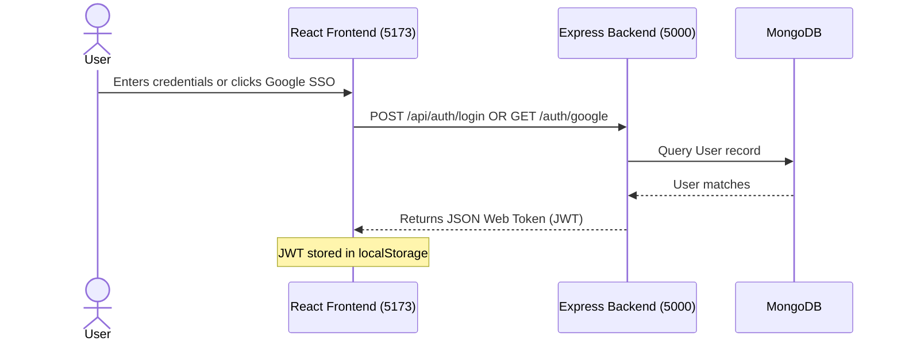
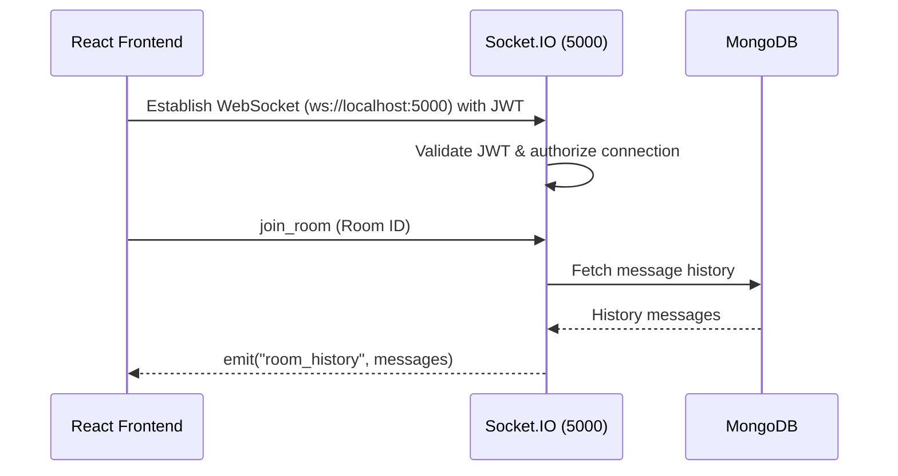
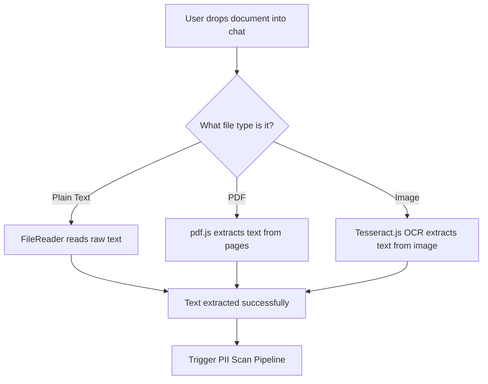
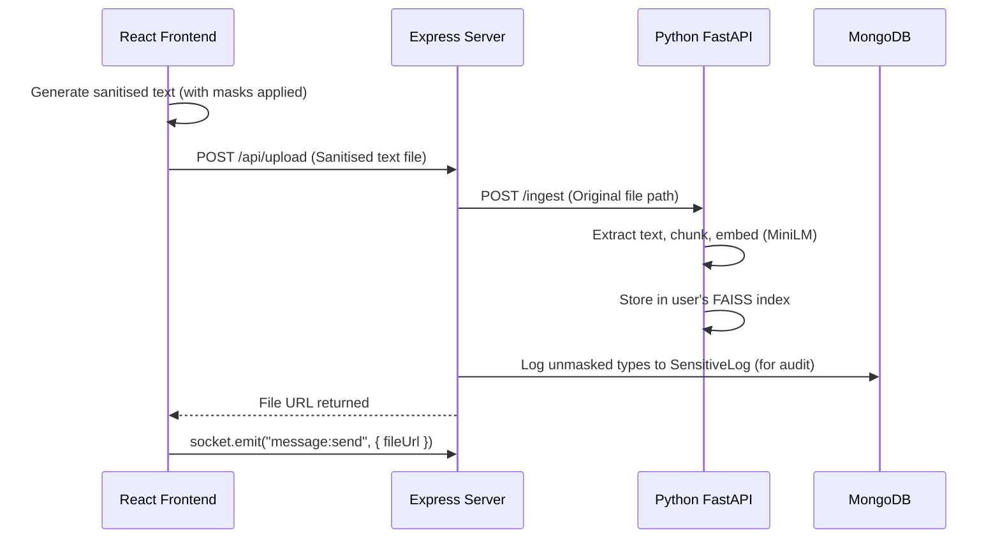
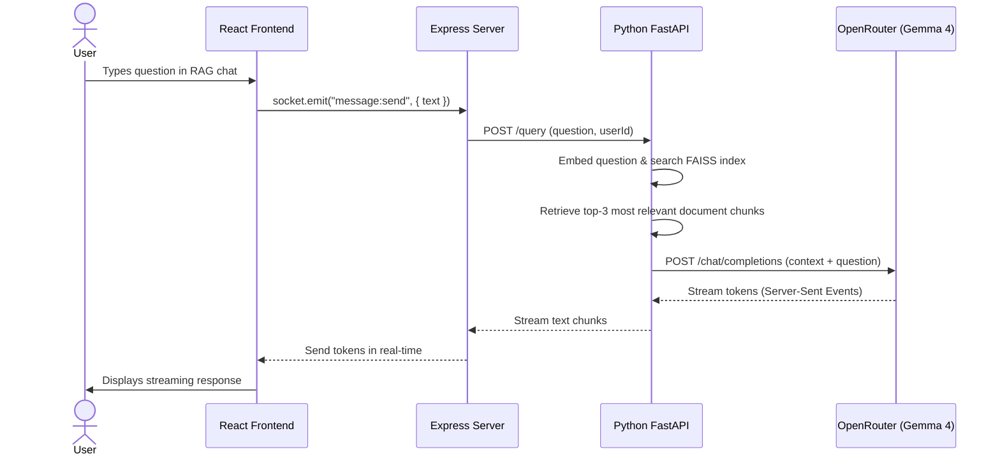

# CipherX Step-by-Step Pipeline Walkthrough

Welcome to the **CipherX Pipeline Walkthrough**! This document explains how the entire project functions step-by-step. 

CipherX operates on a **three-tier architecture** with three servers running concurrently:
1. **Frontend Server (Vite + React)** on Port `5173` — Handles the user interface, real-time message rendering, file previewing, and interactive masking controls.
2. **Backend Server (Node.js + Express + Socket.IO)** on Port `5000` — Coordinates databases (MongoDB), processes WebSocket connections, handles user authentication, runs regular-expression PII scanners, and exposes file-upload paths.
3. **AI / RAG Service (Python + FastAPI)** on Port `8000` — Hosts the machine learning model (RandomForest classifier), extracts embeddings, creates per-user FAISS indexes, and streams answers from the Large Language Model (Gemma-4-31B).

Here is exactly how these components work together in sequence.

---

## Step 1: User Authentication & Session Setup

Before a user can chat or scan files, they must log in.



1. **User Login:** The user enters credentials on the login screen (`Login.jsx`).
2. **Token Generation:** The backend (`authController.js`) validates the user and signs a JWT containing the user's ID and name:
   ```javascript
   const token = jwt.sign({ id: user._id, name: user.name }, JWT_SECRET);
   ```
3. **Session Storage:** The frontend receives this token, stores it in `localStorage`, and updates the application state. All future API requests will attach this JWT in the headers (`Authorization: Bearer <token>`).

---

## Step 2: Live Room Join & Real-Time Chat

Once logged in, the user is redirected to `Home.jsx` (the main dashboard).



1. **Socket.IO Connection:** The client establishes a WebSocket connection. The server validates the user's JWT inside the Socket.IO handshake middleware to prevent unauthorized eavesdropping.
2. **Joining a Room:** When a user selects a contact or chatroom, the client emits a `join_room` event. The server places the socket into a Socket.IO room instance (`socket.join(roomId)`).
3. **Messaging:** When the user types and sends a text message, it is sent to the server. The server stores it in MongoDB and broadcasts it in real-time to everyone in the room:
   ```javascript
   io.to(roomId).emit("message:receive", message);
   ```

---

## Step 3: Document Upload & Client-Side Interception

When the user wants to send a file (PDF, TXT, or Image), CipherX **intercepts** it to prevent data leaks.



1. **Plain Text:** The browser reads the file content directly using `FileReader.readAsText()`.
2. **PDF File:** The frontend uses **pdf.js** to parse pages, extract the text content, and render a high-quality Canvas preview.
3. **Image (OCR):** If an image contains text, **Tesseract.js** runs local Optical Character Recognition (OCR) inside the browser to extract all legible characters.

---

## Step 4: The Dual PII Scan Pipeline (Express + FastAPI)

Once the raw text is gathered, it is sent to `POST /api/scan` on the backend. This endpoint starts the core hybrid intelligence flow:

```mermaid
flowchart TD
    subgraph Express Backend (Port 5000)
        A[Extracted Text] --> B[Regex Engine]
        B -->|High-Precision Matches| C[Regex Results]
    end

    subgraph FastAPI ML Service (Port 8000)
        A -->|POST /detect-pii| D[Tokenization]
        D --> E[Feature Extraction]
        E --> F[RandomForest Classifier]
        F --> G[IOB Sequence Decoding]
        G --> H[Strict Format Checks]
        H -->|High-Recall Matches| I[ML Results]
    end

    C --> J[Merge & Deduplicate Engine]
    I --> J
    J --> K[Final Unique PII List]
```

### The Merging & Sanitization Logic
1. **Regex Scanning:** The Express server runs hand-crafted regex rules first. High-priority matches (like Email and Aadhaar) claim their match ranges so they cannot be double-counted as phone numbers or bank accounts.
2. **Context-Gated Filters:** Matches for OTP and Bank Accounts are only accepted if keywords like `"otp"`, `"code"`, `"bank"`, or `"account"` appear nearby on the same line. If pincode keywords like `"postal"` or `"zip"` are found, the 6-digit OTP matches are skipped.
3. **FastAPI ML Classification:** In parallel, the Python FastAPI service classifies each token using a trained RandomForest model, outputs predicted label sequences, and processes them through a validation check (e.g. validating dates of birth and alphanumeric structures to filter out fragmented model noise like `"23/"`).
4. **Deduplication:** The Express server merges the outputs. If a value was already found by high-precision Regex, the ML result is ignored. Otherwise, it is added.

---

## Step 5: Interactive Masking & Redaction

The detected PII is returned to the React frontend and displayed in the **🔑 Sensitive Details** panel.

```
🔑 Sensitive Details
-----------------------------------------------
🔒 Phone: +91 90999 90999         [ Mask / Unmask ]
🔒 DOB: 21-11-2004               [ Mask / Unmask ]
```

1. **State Management:** React keeps track of which items are toggled "Masked".
2. **Masking Calculations:** If an item is masked, the preview text replaces the character ranges with standard redacting masks:
   - *Phone Number:* `+91 90999 90999` becomes `****XX9999` (keeps final 4 digits for context)
   - *Aadhaar:* `1234 5678 9012` becomes `XXXX XXXX 9012`
   - *Email:* `alex@gmail.com` becomes `a***@gmail.com`
3. **Real-time Feedback:** The main document preview window updates live, displaying the masked version instantly.

---

## Step 6: Secured File Transmission & Vector Ingestion

When the user reviews the document and clicks **Send**:



1. **Masked File Creation:** React creates a new text file containing the **masked version** of the document.
2. **File Storage:** The masked file is uploaded to the backend via Multer and saved in `/uploads/`.
3. **RAG Ingestion:** The Express server notifies the Python RAG service to ingest the **original** file into the user's vector store (so that the RAG model can query the actual unredacted information later, privately).
4. **Audit Logging:** The backend logs the *count* and *type* of masked items in MongoDB (`SensitiveLog.js`) so the user can see their personal privacy protection statistics.

---

## Step 7: Document Q&A (RAG Assistant)

A special system user `"cipherx"` acts as the document RAG assistant.



1. **Query Embeddings:** When you ask the bot a question, the Python service converts the question into a semantic vector using `SentenceTransformer`.
2. **FAISS Retrieval:** It performs a vector similarity search in the user's FAISS directory to find the top 3 matching chunks of text from their uploaded files.
3. **LLM Prompt Enrichment:** It constructs a context prompt:
   ```
   Answer the question using the context:
   [Context retrieved from FAISS]
   Question: [User's question]
   ```
4. **SSE Streaming:** The prompt is sent to OpenRouter. The streamed response is piped back to the Node server, which broadcasts the tokens in real-time to the React UI, creating a typing-assistant effect.
