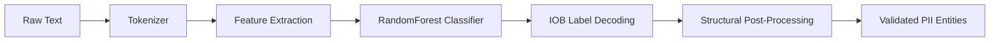
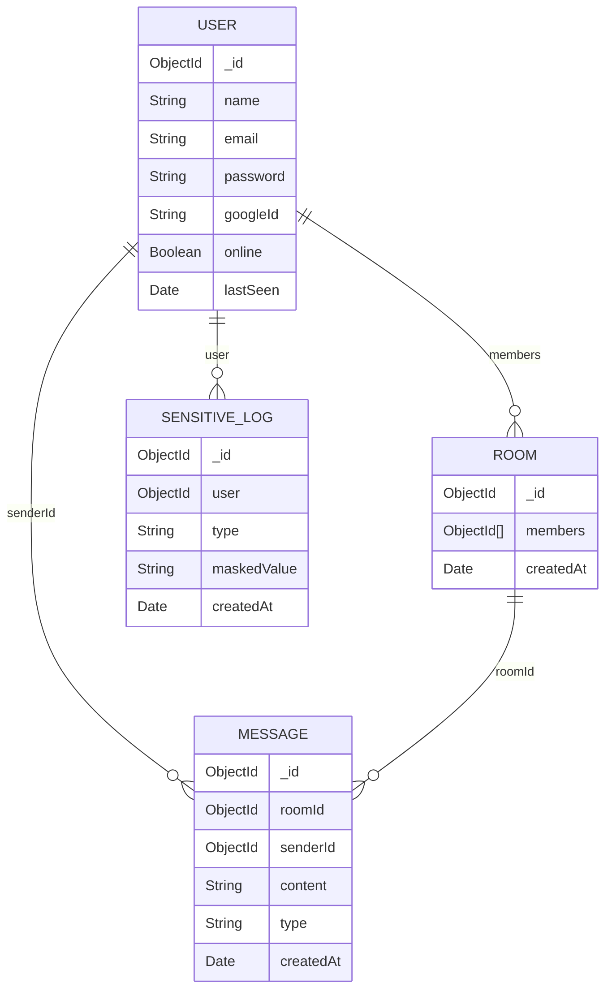
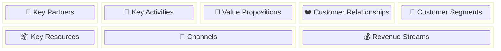

# CipherX — Intelligent Secure Communication Platform

## Project Report & Technical Documentation

---

## 1. Project Overview

**CipherX** is an end-to-end intelligent secure communication platform that combines real-time encrypted messaging with AI-powered document intelligence. It enables users to chat securely, share files, and automatically detect, classify, and mask **Personally Identifiable Information (PII)** before transmission — ensuring data privacy by design.

The platform addresses a critical gap in modern communication tools: the accidental leakage of sensitive data (phone numbers, Aadhaar, PAN, bank accounts, etc.) through document sharing. CipherX intercepts files at the point of sharing, scans them using a hybrid Regex + ML pipeline, presents detected PII to the user for selective masking, and only transmits the sanitized version.

---

## 2. System Architecture

```mermaid
graph TB
    subgraph "Frontend — React + Vite"
        A[Login / Register] --> B[Home Dashboard]
        B --> C[Real-Time Chat]
        B --> D[File Upload & Preview]
        D --> E[PII Scan Trigger]
        E --> F[Sensitive Details Panel]
        F --> G[Mask/Unmask Controls]
        G --> H[Secured File Send]
    end

    subgraph "Backend — Node.js Express"
        I[Auth Routes] --> J[JWT Middleware]
        K[Scan Route] --> L[Regex PII Engine]
        K --> M[ML PII Service Call]
        L --> N[Merge & Deduplicate]
        M --> N
        N --> O[Return Detected PII]
        P[Upload Route] --> Q[File Storage]
        R[Analytics Route] --> S[Sensitive Logs DB]
        T[Socket.IO Server] --> U[Real-Time Messaging]
    end

    subgraph "RAG Service — Python FastAPI"
        V[/detect-pii Endpoint] --> W[Tokenizer]
        W --> X[Feature Extraction]
        X --> Y[RandomForest Classifier]
        Y --> Z[IOB Decoding]
        Z --> AA[Post-Processing & Validation]
        AB[/query Endpoint] --> AC[FAISS Vector Search]
        AC --> AD[LLM Streaming Response]
        AE[/ingest Endpoint] --> AF[Document Chunking]
        AF --> AG[Sentence Embeddings]
        AG --> AH[FAISS Index Storage]
    end

    subgraph "External Services"
        AI[OpenRouter LLM API]
        AJ[Google OAuth 2.0]
    end

    subgraph "Database"
        AK[(MongoDB)]
    end

    B --> I
    D --> K
    H --> P
    B --> R
    C --> T
    K --> V
    AB --> AI
    I --> AJ
    J --> AK
    T --> AK
    S --> AK
```

---

## 3. Detailed Working — Step by Step

### Step 1 — User Authentication

The user registers or logs in via **email/password** or **Google OAuth 2.0**.

| Action | Mechanism |
|--------|-----------|
| Register | `POST /auth/register` — password hashed with **bcrypt**, user stored in MongoDB |
| Login | `POST /auth/login` — credentials verified, **JWT token** issued (stored in `localStorage`) |
| Google SSO | `GET /auth/google` → Google OAuth flow → callback creates/links user → JWT issued |
| Session | JWT token sent as `Authorization: Bearer <token>` header on all subsequent API calls |

### Step 2 — Real-Time Chat

Once authenticated, the user enters the **Home Dashboard** which establishes a **Socket.IO** WebSocket connection.

| Feature | Implementation |
|---------|---------------|
| Room Management | Users create/join chat rooms; members stored in MongoDB `Room` collection |
| Message Send | `socket.emit("message:send")` → server validates room membership → stores `Message` in MongoDB → broadcasts to room via `io.to()` |
| Typing Indicators | `socket.emit("typing")` → broadcast to room members in real-time |
| Presence | Online/offline status tracked via `onlineUsers` Map; emitted as `presence:online` / `presence:offline` events |
| AI Chat | Special `"cipherx"` room ID routes messages to the **RAG AI assistant** instead of MongoDB |

### Step 3 — File Upload & Preview

When a user attaches a file for sharing, the frontend renders a **live preview** before sending:

| File Type | Preview Method |
|-----------|---------------|
| Plain Text (`.txt`, `.csv`) | Read via `FileReader.readAsText()` → rendered in a `<pre>` block |
| PDF | Rendered using **pdf.js** canvas rendering |
| Images (`.jpg`, `.png`) | Displayed as `` with `URL.createObjectURL()` |

### Step 4 — PII Scanning (The Core Intelligence)

The file content is sent to `POST /api/scan` which triggers a **dual-engine detection pipeline**:

#### Engine 1: Regex Detection (High Precision)

The backend runs purpose-built regular expressions against the extracted text, line by line:

| PII Type | Regex Pattern | Example Match |
|----------|---------------|---------------|
| **Phone** | `(?:\+91[\s-]?)?(?:0)?[6-9]\d[\s-]?...(?!\d)` | `+91 90999 90999`, `9876543210` |
| **Aadhaar** | `\b\d{4}[\s-]?\d{4}[\s-]?\d{4}\b` (exactly 12 digits) | `1234 5678 9012` |
| **PAN** | `\b[A-Z]{5}[0-9]{4}[A-Z]\b` | `ABCDE1234F` |
| **DOB** | `\b(?:0?[1-9]\|[12][0-9]\|3[01])[-/]...` | `21-11-2004` |
| **Email** | `\b[a-zA-Z0-9._%+-]+@[a-zA-Z0-9.-]+\.[a-z]{2,}\b` | `user@example.com` |
| **OTP** | `\b(?:\d{4}\|\d{6})\b` (context-gated) | `1234` (only if near keywords like "otp", "code") |
| **Bank** | `\b\d{9,18}\b` (context-gated) | `123456789012` (only if near "bank", "account") |

**Priority Order**: Email → Aadhaar → PAN → DOB → Phone → OTP → Bank. Higher-priority matches "claim" their digit spans so lower-priority scanners cannot re-match them.

**Context Gating**: OTP and Bank matches only fire if the surrounding line contains relevant keywords (e.g., `"otp"`, `"verification"`, `"bank"`, `"account"`). Additionally, 6-digit OTP candidates are rejected if the line contains pincode/postal/zip keywords.

#### Engine 2: ML Classification (High Recall)

Simultaneously, the text is sent to the Python FastAPI service at `POST /detect-pii`:



| Stage | Description |
|-------|-------------|
| **Tokenization** | Text split into tokens preserving emails as single tokens, separating punctuation |
| **Feature Extraction** | For each token: character shape, length, case, prefix/suffix tokens (±2 window), contextual keywords (±3 window) |
| **Classification** | Trained **scikit-learn RandomForest** pipeline predicts IOB labels (`B-phone`, `I-aadhaar`, `O`, etc.) |
| **IOB Decoding** | Consecutive `B-` and `I-` labels grouped into complete entity spans |
| **Post-Processing** | Structural validation layer that: |
| | • Re-maps misclassified types (e.g., 10-digit "aadhaar" → "phone") |
| | • Validates DOB format against date patterns |
| | • Validates PAN format (`[A-Z]{5}\d{4}[A-Z]`) |
| | • Validates Aadhaar digit count (exactly 12) |
| | • Validates email structure |
| | • Filters out artifacts (country codes alone, partial fragments like `"23/"`) |
| | • Rejects pincodes from OTP classification using line-context analysis |

#### Merging Strategy

```
regexResults (100% precision)  ──┐
                                 ├── Normalize → Deduplicate → Merged List
mlResults (high recall)  ────────┘
```

Regex results are prioritized. ML results are added only if their normalized value is not already captured by regex. This ensures zero false negatives on standard formats while gaining contextual recall from the ML model.

### Step 5 — AI Summary Generation

The first 800 characters of the document are sent to an **LLM** (Google Gemma 4 31B via OpenRouter API) to generate a human-readable summary of the document's contents. This summary is displayed at the top of the Sensitive Details panel.

### Step 6 — User Review & Selective Masking

The frontend displays all detected PII in a unified **"🔑 Sensitive Details"** panel:

| Feature | Behavior |
|---------|----------|
| Flat List | All PII types shown in a single list with type icon and label |
| Mask Button | Toggles masking — replaces the value in the document preview with `****XXXX` (showing last 4 digits for phone/Aadhaar) |
| Real-Time Preview | Document preview updates instantly as items are masked/unmasked |
| Industry-Standard Redaction | Phone: `****XX6789`, Aadhaar: `XXXX XXXX 9012`, PAN: `XXXXX1234X` |

### Step 7 — Secured File Transmission

When the user clicks **Send**:

1. The **modified** (masked) document content is packaged as a new `Blob`
2. Uploaded to `POST /api/upload` (JWT-authenticated) → stored in `/uploads/`
3. The upload URL is sent via Socket.IO to the chat room
4. **Unmasked items** are logged to `POST /api/analytics/log` for the user's privacy audit trail

### Step 8 — RAG AI Assistant

CipherX includes a built-in AI assistant powered by **Retrieval-Augmented Generation (RAG)**:

| Component | Technology |
|-----------|------------|
| Embeddings | **SentenceTransformers** (`all-MiniLM-L6-v2`) |
| Vector Store | **FAISS** (Facebook AI Similarity Search) |
| LLM | **Google Gemma 4 31B** via OpenRouter API |
| Streaming | Server-Sent Events (SSE) parsed and streamed to frontend |

When a user uploads a file, its content is chunked, embedded, and stored in a per-user FAISS index. Subsequent queries retrieve the top-k most relevant chunks, inject them as context into the LLM prompt, and stream the response back in real-time.

---

## 4. Technology Stack

### Frontend

| Tool | Version | Purpose |
|------|---------|---------|
| **React** | 19.x | Component-based UI framework |
| **Vite** | 8.x | Lightning-fast dev server and bundler |
| **React Router DOM** | 7.x | Client-side routing (Login, Register, Home) |
| **Socket.IO Client** | 4.x | Real-time WebSocket communication |
| **Axios** | 1.x | HTTP client for API calls |
| **Vanilla CSS** | — | Custom styling with glassmorphism, gradients, animations |

### Backend

| Tool | Version | Purpose |
|------|---------|---------|
| **Node.js** | LTS | Server runtime |
| **Express** | 5.x | HTTP framework and REST API router |
| **Socket.IO** | 4.x | Real-time bidirectional WebSocket server |
| **Mongoose** | 9.x | MongoDB ODM for data modeling |
| **JWT (jsonwebtoken)** | 9.x | Stateless authentication tokens |
| **bcrypt** | 6.x | Password hashing (10 salt rounds) |
| **Passport.js** | 0.7 | Google OAuth 2.0 SSO strategy |
| **Multer** | 2.x | Multipart file upload handling |
| **Tesseract.js** | 7.x | OCR — extract text from images |
| **pdf-parse** | 1.x | Extract text from PDF documents |
| **pdf-lib** | 1.x | PDF generation and manipulation |
| **Axios** | 1.x | HTTP client for calling ML and LLM services |
| **Morgan** | 1.x | HTTP request logging middleware |
| **dotenv** | 17.x | Environment variable management |

### RAG / ML Service

| Tool | Version | Purpose |
|------|---------|---------|
| **Python** | 3.10 | Runtime |
| **FastAPI** | — | Async HTTP framework for ML endpoints |
| **Uvicorn** | — | ASGI server |
| **scikit-learn** | — | RandomForest classifier for PII detection |
| **SentenceTransformers** | — | Semantic text embeddings (`all-MiniLM-L6-v2`) |
| **FAISS** | — | High-performance vector similarity search |
| **Pydantic** | — | Request/response validation models |

### Database & External Services

| Service | Purpose |
|---------|---------|
| **MongoDB** | Primary database — Users, Rooms, Messages, SensitiveLog |
| **OpenRouter API** | LLM gateway — routes to Google Gemma 4 31B for summaries and RAG |
| **Google OAuth 2.0** | Social sign-in authentication |

---

## 5. Database Schema



---

## 6. API Endpoints

### Authentication

| Method | Endpoint | Auth | Description |
|--------|----------|------|-------------|
| `POST` | `/auth/register` | ✗ | Create new user account |
| `POST` | `/auth/login` | ✗ | Login and receive JWT |
| `GET` | `/auth/google` | ✗ | Initiate Google OAuth flow |
| `GET` | `/auth/google/callback` | ✗ | Google OAuth callback |

### Core Features

| Method | Endpoint | Auth | Description |
|--------|----------|------|-------------|
| `POST` | `/api/scan` | ✗ | Upload file → extract text → detect PII → return results |
| `POST` | `/api/upload` | ✓ | Upload secured/masked file to server storage |
| `GET` | `/api/health` | ✗ | Server health check |

### Chat & Rooms

| Method | Endpoint | Auth | Description |
|--------|----------|------|-------------|
| `POST` | `/api/rooms/create` | ✓ | Create a new chat room |
| `GET` | `/api/rooms` | ✓ | List user's rooms |
| `GET` | `/api/rooms/:id/messages` | ✓ | Fetch room message history |

### Analytics

| Method | Endpoint | Auth | Description |
|--------|----------|------|-------------|
| `POST` | `/api/analytics/log` | ✓ | Log unmasked sensitive items for audit |
| `GET` | `/api/analytics` | ✓ | Get user's PII exposure statistics |

### RAG Service (Port 8000)

| Method | Endpoint | Description |
|--------|----------|-------------|
| `POST` | `/detect-pii` | ML-based PII detection |
| `POST` | `/query` | RAG question answering (streaming) |
| `POST` | `/ingest` | Ingest file into vector store |
| `GET` | `/` | Health check |

---

## 7. Security Architecture

| Layer | Mechanism |
|-------|-----------|
| **Authentication** | JWT tokens with configurable secret; Google OAuth 2.0 SSO |
| **Password Storage** | bcrypt hashing (never stored in plain text) |
| **API Protection** | `authenticate` middleware validates JWT on protected routes |
| **Socket Security** | Socket.IO `io.use()` middleware verifies JWT before connection |
| **File Handling** | Multer with server-side storage; files stored in `/uploads/` |
| **PII Masking** | Client-side masking before upload; masked values logged for audit |
| **Environment Secrets** | API keys and secrets managed via `.env` files (dotenv) |

---

## 8. Business Model Canvas



### 🤝 Key Partners

| Partner | Role |
|---------|------|
| **OpenRouter / Google** | LLM API provider (Gemma 4 31B) for AI summaries and RAG |
| **Google Cloud** | OAuth 2.0 identity provider for SSO |
| **MongoDB Atlas** | Managed database hosting (production) |
| **Cloud Providers (AWS/GCP/Azure)** | Infrastructure hosting, CDN, and compute |
| **Open-Source Community** | React, FAISS, scikit-learn, SentenceTransformers ecosystems |
| **Regulatory Bodies (CERT-In, DPDP)** | Compliance guidance for India's data protection laws |

### 🔧 Key Activities

| Activity | Description |
|----------|-------------|
| **PII Detection R&D** | Continuous improvement of ML models and regex patterns for new PII types |
| **Platform Development** | Feature development (video calls, group file sharing, admin dashboards) |
| **Model Training** | Retraining RandomForest on expanded datasets; evaluating transformer-based NER |
| **Security Audits** | Penetration testing, vulnerability scanning, compliance certification |
| **User Onboarding** | Documentation, tutorials, enterprise integration guides |

### 💎 Value Propositions

| Proposition | Description |
|-------------|-------------|
| **Automatic PII Detection** | AI-powered scanning catches sensitive data humans miss — phone numbers, Aadhaar, PAN, DOB, bank accounts, emails, OTPs |
| **User-Controlled Masking** | Users decide exactly what to redact before sharing — full transparency and control |
| **Hybrid Detection Engine** | Regex (100% precision on standard formats) + ML (high recall on contextual patterns) = industry-leading accuracy |
| **Secure Communication** | End-to-end encrypted messaging with real-time presence and typing indicators |
| **Document Intelligence** | AI-generated file summaries and RAG-powered Q&A over shared documents |
| **Compliance Ready** | Audit trail of all PII exposure events; aligned with India's DPDP Act 2023 |
| **Zero Configuration** | Works instantly — no training data, no setup; upload a file and get results |

### ❤️ Customer Relationships

| Type | Description |
|------|-------------|
| **Self-Service** | Web-based platform with intuitive UI; no training required |
| **Automated Assistance** | Built-in CipherX AI assistant answers questions about shared documents |
| **Community Support** | Open-source components; GitHub issues and discussions |
| **Enterprise Support** | Dedicated onboarding, SLA-backed support for B2B customers |
| **Privacy Dashboard** | Analytics panel showing historical PII exposure data per user |

### 👥 Customer Segments

| Segment | Use Case |
|---------|----------|
| **Individuals** | Privacy-conscious users sharing personal documents (resumes, IDs, forms) |
| **Small Businesses** | Teams sharing client documents, contracts, financial records |
| **Healthcare** | Clinics and hospitals sharing patient records with PII protection |
| **Education** | Schools sharing student records, mark sheets, certificates |
| **Financial Services** | Banks and fintechs processing KYC documents |
| **Legal Firms** | Lawyers sharing case documents with client PII |
| **Government** | Public sector agencies handling citizen data |
| **HR Departments** | Companies processing employee documents (Aadhaar, PAN, bank details) |

### 📦 Key Resources

| Resource | Description |
|----------|-------------|
| **ML PII Model** | Trained RandomForest pipeline (`pii_model.pkl`) — 2.4 MB serialized model |
| **Regex Engine** | Hand-tuned regular expressions for 7 Indian PII types |
| **FAISS Vector Store** | Per-user document embeddings for RAG retrieval |
| **SentenceTransformer** | `all-MiniLM-L6-v2` embedding model for semantic search |
| **Engineering Team** | Full-stack developers, ML engineers, security specialists |
| **Cloud Infrastructure** | Servers, databases, CDN, monitoring |

### 📣 Channels

| Channel | Description |
|---------|-------------|
| **Web Application** | Primary access point — `https://cipherx.app` |
| **API / SDK** | RESTful API for enterprise integration into existing workflows |
| **Browser Extension** (future) | Scan attachments in Gmail, Outlook before sending |
| **Mobile App** (future) | React Native companion app |
| **Partnerships** | White-label solution for enterprise messaging platforms |

### 💰 Revenue Streams

| Stream | Model | Description |
|--------|-------|-------------|
| **Freemium SaaS** | Free / Pro / Enterprise | Free tier: 50 scans/month; Pro: unlimited scans + analytics; Enterprise: custom |
| **Per-Scan Pricing** | Pay-as-you-go | API customers pay per document scanned |
| **Enterprise Licenses** | Annual contract | On-premise deployment for regulated industries |
| **White-Label** | Revenue share | Licensed to messaging/email platforms as an embedded PII scanner |
| **Compliance Consulting** | Professional services | DPDP Act compliance audits and integration support |

### 📉 Cost Structure

| Cost | Description |
|------|-------------|
| **LLM API Costs** | OpenRouter API calls for summaries and RAG (per-token pricing) |
| **Cloud Hosting** | Servers, MongoDB Atlas, CDN bandwidth |
| **ML Compute** | Model training and inference (CPU-based currently) |
| **Development** | Engineering salaries, tools, and infrastructure |
| **Security & Compliance** | Audits, certifications, legal counsel |

---

## 9. Folder Structure

```
CipherX/
├── backend/                    # Node.js Express Server
│   ├── app.js                  # Main server entry point (Express + Socket.IO)
│   ├── config/
│   │   ├── db.js               # MongoDB connection
│   │   └── passport.js         # Google OAuth strategy
│   ├── controllers/            # Route handlers
│   ├── middleware/
│   │   └── auth.js             # JWT authentication middleware
│   ├── models/
│   │   ├── User.js             # User schema
│   │   ├── Room.js             # Chat room schema
│   │   ├── Message.js          # Message schema
│   │   └── SensitiveLog.js     # PII audit log schema
│   ├── routes/
│   │   ├── authRoutes.js       # Login, Register, Google OAuth
│   │   ├── scan.js             # PII scanning (Regex + ML merge)
│   │   ├── upload.js           # File upload handler
│   │   ├── analytics.js        # PII exposure analytics
│   │   ├── rag.js              # RAG proxy to Python service
│   │   ├── room.js             # Chat room CRUD
│   │   └── user.js             # User profile
│   ├── uploads/                # Stored uploaded files
│   └── eng.traineddata         # Tesseract OCR language data
│
├── frontend/                   # React + Vite SPA
│   └── src/
│       ├── App.jsx             # Root component with routing
│       ├── main.jsx            # React DOM entry point
│       ├── pages/
│       │   ├── Home.jsx        # Main dashboard (chat + file intel)
│       │   ├── Login.jsx       # Login page
│       │   └── Register.jsx    # Registration page
│       ├── context/            # React context providers
│       ├── css/                # Stylesheets
│       └── assets/             # Static assets
│
├── rag/                        # Python FastAPI ML Service
│   ├── app.py                  # FastAPI entry point
│   ├── src/
│   │   ├── pii_detector.py     # ML PII detection (RandomForest + post-processing)
│   │   ├── pii_model.pkl       # Serialized ML pipeline
│   │   ├── search.py           # RAG search + LLM streaming
│   │   ├── vectorstore.py      # FAISS vector store wrapper
│   │   ├── embedding.py        # SentenceTransformer embeddings
│   │   └── data_loader.py      # File ingestion (text, PDF)
│   ├── faiss_store/            # Per-user FAISS indexes
│   └── data/                   # Training data
│
└── mongodb-data/               # Local MongoDB data directory
```

---

## 10. Research Contributions

| Area | Contribution |
|------|-------------|
| **Hybrid PII Detection** | Novel architecture combining deterministic regex (precision) with contextual ML classification (recall), using a priority-based merge with digit-claiming deduplication |
| **Structural Post-Processing** | ML predictions validated against format-specific rules (digit counts, date patterns, PAN structure), correcting model misclassifications without retraining |
| **Context-Gated Detection** | OTP and Bank Account detection gated by surrounding keyword analysis, with explicit pincode/postal exclusion logic |
| **User-Controlled Privacy** | Shift from all-or-nothing encryption to granular, per-item masking — users retain control over what is shared |
| **Per-User RAG** | Isolated FAISS vector stores per user, enabling private document Q&A without cross-user data leakage |

---

> **CipherX** — *Privacy by Intelligence, Security by Design.*
